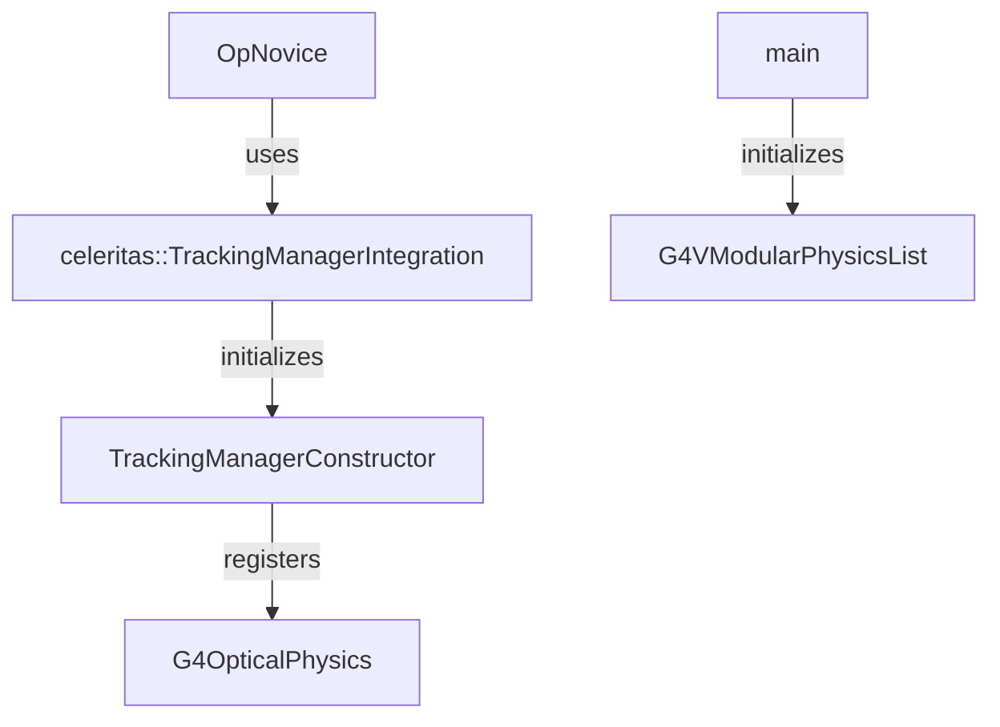
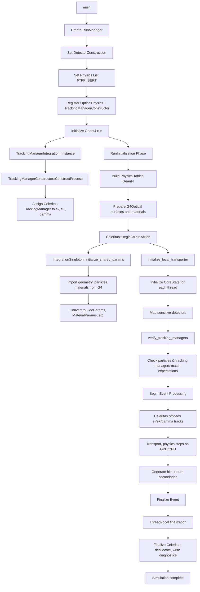

```
 auto& tmi = celeritas::TrackingManagerIntegration::Instance();
```
initiates the Celeritas tracking manager integration.


detector constructed, surface params loaded, activated te celeritas tracking manager constructor ()from  ``` trackingmanagerconstructor::Consturct process()``` then 

### printing
TMI::instance called / tmi gets initialised
<< Geant4 Physics List simulation engine: FTFP_BERT
[R] TrackingManagerConstructor shared params, localtransporter, offload physics, physics constructor
[R] TrackingManagerConstructor:: integration singleton
[R] TrackingManagerInstance() called
material properties printed
g4 optical surfaces loaded
G4OpticalPhysics:: Add Optical Physics Processes
Optical physics constructed.
[M] debug@TrackingManagerConstructor.cc:88: Activating tracking manager
[R] TrackingManagerConstructor::OffloadParticles() called //
[R] TrackingManagerConstructor::ConstructProcess() called for particle: e-
[R] TrackingManagerConstructor::ConstructProcess() set tracking manager for particle: 0x60000039fbe0

[R] TrackingManagerConstructor - set tracking manager for particle
run is initialised
 [M] debug@TrackingManager.cc:94: Preparing physics table for e+
[M] debug@TrackingManager.cc:94: Preparing physics table for e-
[M] debug@TrackingManager.cc:94: Preparing physics table for gamma
[M] debug@TrackingManager.cc:54: Building physics table for gamma
[M] debug@TrackingManager.cc:54: Building physics table for e-
[displays all the prrocesses for e-, e+, gamma (which is photoelectric, compton, conversion, Rayl (no scintillation, no cerenkov ?))]
//at an individual thread (first TM constructor ::construct process() called, for particle, and set tracking manager)
[W] debug@TrackingManagerConstructor.cc:88: Activating tracking manager
[R] TrackingManagerConstructor::OffloadParticles() called
[R] TrackingManagerConstructor::ConstructProcess() called for particle: e-
[R] TrackingManagerConstructor::ConstructProcess() set tracking manager for particle: 0x6000004da3e0
--> G4TaskRunManager::CreateAndStartWorkers() --> Initializing workers...
OpNoviceActionInitialization: runacrjion, generator set. (TMC is called, particles offloated, activating track manager (for all the threads), )
Run 0 starts.
Beginning of run action.
[R] TrackingManagerIntegration::Instance() called


[M] debug@IntegrationSingleton.cc:105: Initializing shared params
then u go through the list of initialisation through the 
[M] debug@IntegrationSingleton.cc:105: Initializing shared params
[M] info@FrameworkInput.cc:32: Activating Celeritas version 0.6.0-106+optical-error.fa73e49f on CPU
[M] status@GeantImporter.cc:1305: Transferring data from Geant4
[M] debug@GeantImporter.cc:382: Loaded 4 particles
[M] info@GeantImporter.cc:251: Estimated custom properties SCINTILLATIONLAMBDAMEAN1=3.085e-07 and SCINTILLATIONLAMBDASIGMA1=0 from Geant4-defined property SCINTILLATIONCOMPONENT1
[M] info@GeantImporter.cc:251: Estimated custom properties SCINTILLATIONLAMBDAMEAN2=3.18267e-07 and SCINTILLATIONLAMBDASIGMA2=6.03834e-08 from Geant4-defined property SCINTILLATIONCOMPONENT2
[M] debug@GeantImporter.cc:609: Loaded 2 optical materials
[M] debug@GeantImporter.cc:441: Loaded 7 isotopes
[M] debug@GeantImporter.cc:494: Loaded 3 elements
[M] debug@GeantImporter.cc:678: Loaded 2 geo materials
[M] debug@GeantImporter.cc:782: Loaded 2 physics materials
[M] debug@GeantImporter.cc:964: Filtered process 'Transportation' (RTTI: G4Transportation) for particle e+
[M] debug@GeantProcessImporter.cc:345: Saving MSC model 'UrbanMsc' for particle e+ (-11)
[M] debug@GeantProcessImporter.cc:345: Saving MSC model 'WentzelVIUni' for particle e+ (-11)
[M] debug@GeantProcessImporter.cc:119: Saving process 'eIoni' for particle e+ (-11)
[M] debug@GeantProcessImporter.cc:119: Saving process 'eBrem' for particle e+ (-11)
[M] debug@GeantProcessImporter.cc:119: Saving process 'annihil' for particle e+ (-11)
[M] debug@GeantProcessImporter.cc:119: Saving process 'CoulombScat' for particle e+ (-11)
[M] debug@GeantImporter.cc:964: Filtered process 'positronNuclear' (RTTI: G4PositronNuclearProcess) for particle e+
[M] debug@GeantImporter.cc:929: Postponing the processCerenkov
[M] debug@GeantImporter.cc:929: Postponing the processScintillation
[M] debug@GeantImporter.cc:964: Filtered process 'Transportation' (RTTI: G4Transportation) for particle e-
[M] debug@GeantProcessImporter.cc:345: Saving MSC model 'UrbanMsc' for particle e- (11)
[M] debug@GeantProcessImporter.cc:345: Saving MSC model 'WentzelVIUni' for particle e- (11)
[M] debug@GeantProcessImporter.cc:119: Saving process 'eIoni' for particle e- (11)
[M] debug@GeantProcessImporter.cc:119: Saving process 'eBrem' for particle e- (11)
[M] debug@GeantProcessImporter.cc:119: Saving process 'CoulombScat' for particle e- (11)
[M] debug@GeantImporter.cc:964: Filtered process 'electronNuclear' (RTTI: G4ElectronNuclearProcess) for particle e-
[M] debug@GeantImporter.cc:852: Skipping process 'Cerenkov' (RTTI: G4Cerenkov) for particle e-: duplicate of particle e+
[M] debug@GeantImporter.cc:852: Skipping process 'Scintillation' (RTTI: G4Scintillation) for particle e-: duplicate of particle e+
[M] debug@GeantImporter.cc:964: Filtered process 'Transportation' (RTTI: G4Transportation) for particle gamma
[M] debug@GeantProcessImporter.cc:119: Saving process 'phot' for particle gamma (22)
[M] debug@GeantProcessImporter.cc:119: Saving process 'compt' for particle gamma (22)
[M] debug@GeantProcessImporter.cc:119: Saving process 'conv' for particle gamma (22)
[M] debug@GeantProcessImporter.cc:119: Saving process 'Rayl' for particle gamma (22)
[M] debug@GeantImporter.cc:852: Skipping process 'Scintillation' (RTTI: G4Scintillation) for particle gamma: duplicate of particle e+
[M] debug@GeantImporter.cc:964: Filtered process 'Transportation' (RTTI: G4Transportation) for particle opticalphoton
[M] debug@GeantOpticalModelImporter.cc:68:  Importing optical model absorption
[M] debug@GeantOpticalModelImporter.cc:68:  Importing optical model rayleigh
[M] error@GeantImporter.cc:936: Cannot export unknown process 'OpMieHG' (RTTI: G4OpMieHG)
[M] error@GeantImporter.cc:936: Cannot export unknown process 'OpBoundary' (RTTI: G4OpBoundaryProcess)
[M] debug@GeantOpticalModelImporter.cc:68:  Importing optical model wls
[M] debug@GeantOpticalModelImporter.cc:68:  Importing optical model wls2
[M] debug@GeantImporter.cc:1005: Loaded 11 processes
[M] debug@GeantImporter.cc:1006: Loaded 4 optical models
[M] debug@GeantImporter.cc:815: Loaded 2 regions
[M] debug@GeantImporter.cc:1255: Loaded 4 of 4 volumes
[M] status@GeantImporter.cc:1377: Loading external elemental data
[M] debug@SetupOptions.cc:161: No magnetic field
[M] status@Problem.cc:384: Initializing problem
[M] status@PhysicalVolumeConverter.cc:131: Converting Geant4 geometry elements to ORANGE input
[M] status@InputBuilder.cc:106: Constructing ORANGE surfaces and runtime data
[M] debug@UnitProto.cc:373: Building 'World' inside {}: 0 daughters and 4 materials...
[M] debug@UnitProto.cc:114: ...built World: used 24 of 24 surfaces
[M] debug@OrangeParams.cc:125: Merging runtime data
[M] warning@Problem.cc:408: Geometry contains surfaces that are incompatible with the current ORANGE simple safety algorithm: multiple scattering may result in arbitrarily small steps without displacement
[M] debug@Problem.cc:426: Ignoring surfaces for non-optical problem
[M] warning@ProcessBuilder.cc:268: Omitting coulomb_scat from physics process list
[M] debug@Problem.cc:110: Ignored process class coulomb_scat
[M] debug@Problem.cc:216: Set default track order none
[M] status@CoreParams.cc:375: Celeritas core setup complete
[M] warning@GeantSd.cc:53: Using less accurate navigator-based reconstruction for ORANGE geometry
[M] warning@GeantSd.cc:53: Using less accurate navigator-based reconstruction for ORANGE geometry
[M] warning@GeantVolumeMapper.cc:67: Failed to exactly match ORANGE volume from Geant4 volume 'World'; found 'World@World' by omitting the extension
[M] debug@SensDetInserter.cc:32: Mapped sensitive detector "OpNoviceSD" on logical volume "World"@0x6000032a8fa0 (ID=0) to ORANGE volume "World@World" (ID=4)
[M] warning@GeantVolumeMapper.cc:67: Failed to exactly match ORANGE volume from Geant4 volume 'expHall'; found 'expHall@World' by omitting the extension
[M] debug@SensDetInserter.cc:32: Mapped sensitive detector "OpNoviceSD" on logical volume "expHall"@0x6000032a9040 (ID=1) to ORANGE volume "expHall@World" (ID=1)
[M] warning@GeantVolumeMapper.cc:67: Failed to exactly match ORANGE volume from Geant4 volume 'Tank'; found 'Tank@World' by omitting the extension
[M] debug@SensDetInserter.cc:32: Mapped sensitive detector "OpNoviceSD" on logical volume "Tank"@0x6000032a90e0 (ID=2) to ORANGE volume "Tank@World" (ID=2)
[M] warning@GeantVolumeMapper.cc:67: Failed to exactly match ORANGE volume from Geant4 volume 'Bubble'; found 'Bubble@World' by omitting the extension
[M] debug@SensDetInserter.cc:32: Mapped sensitive detector "OpNoviceSD" on logical volume "Bubble"@0x6000032a9180 (ID=3) to ORANGE volume "Bubble@World" (ID=3)
[M] warning@SharedParams.cc:102: Not offloading particle 'opticalphoton' because it has no physics processes defined
[M] debug@SharedParams.cc:426: Setting number of streams to 12
[M] info@SharedParams.cc:449: Wrote Geant4 diagnostic output to "celeritas.out.json"
[M] diagnostic@ScopedTimeLog.hh:104: ... 0.0106189 s
 ....
 once all of this is done then 
 [W] status@CoreState.cc:80: Celeritas core state initialization complete
G4WT0 > [W] debug@TrackingManagerIntegration.cc:159: Verifying tracking manager
[R] TrackingManagerConstructor::OffloadParticles() called
[R] TrackingManagerIntegration::verify_tracking_managers() called, particle: #in the if loop"e+"@0x112e09e90 (PDG=323)
[R] TrackingManagerIntegration::verify_tracking_managers() called, particle: #in the if loop"gamma"@0x112e09c30 (PDG=344)
[R] TrackingManagerIntegration::verify_tracking_managers() called, particle: #in the if loop"e-"@0x112e09d60 (PDG=324)
G4WT0 > [W] status@CoreState.cc:80: Celeritas core state initialization complete
G4WT0 > [W] debug@TrackingManagerIntegration.cc:159: Verifying tracking manager
G4WT0 > [W] debug@TrackingManager.cc:94: Preparing physics table for e+
G4WT0 > [W] debug@TrackingManager.cc:94: Preparing physics table for e-
G4WT0 > [W] debug@TrackingManager.cc:94: Preparing physics table for gamma
G4WT0 > [W] debug@TrackingManager.cc:54: Building physics table for gamma
G4WT0 > [W] debug@TrackingManager.cc:54: Building physics table for e-
G4WT0 > [W] debug@TrackingManager.cc:54: Building physics table for e+
G4WT0 > ### Run 0 starts on worker thread 0.
Beginning of run action.
[R] TrackingManagerIntegration::Instance() called
G4WT0 > [W] debug@IntegrationSingleton.cc:173: Constructing local state
G4WT0 > [W] debug@HitProcessor.cc:110: Setting up thread-local hit processor for 4 sensitive detectors
G4WT0 > [W] status@CoreState.cc:80: Celeritas core state initialization complete
G4WT0 > [W] debug@TrackingManagerIntegration.cc:159: Verifying tracking manager
G4WT0 > [1/12] debug@LocalTransporter.cc:408: Reconstituted 28 hits for event 9
G4WT0 > [thread 0] Thread-local run terminated.
G4WT0 > [thread 0] Run Summary
G4WT0 > [thread 0]   Number of events processed : 1
G4WT0 > [thread 0]   User=13.030000s Real=1.407924s Sys=0.010000s [Cpu=926.2%]
G4WT0 > [W] status@IntegrationBase.cc:49: Finalizing Celeritas
G4WT0 > [W] debug@IntegrationSingleton.cc:208: Destroying local state
G4WT0 > [1/12] info@LocalTransporter.cc:430: Finalizing Celeritas after 53 steps from 1 offloaded tracks over 1 events, generating 28 hits
G4WT0 > [W] debug@TrackProcessor.cc:94: Deallocating track processor

[M] status@IntegrationBase.cc:49: Finalizing Celeritas
[M] status@IntegrationSingleton.cc:229: Finalizing Celeritas
[M] info@SharedParams.cc:449: Wrote Geant4 diagnostic output to "celeritas.out.json"
[M] debug@SharedParams.cc:356: Resetting shared parameters
[M] debug@CoreState.cc:95: Deallocating host core state (stream 11)
